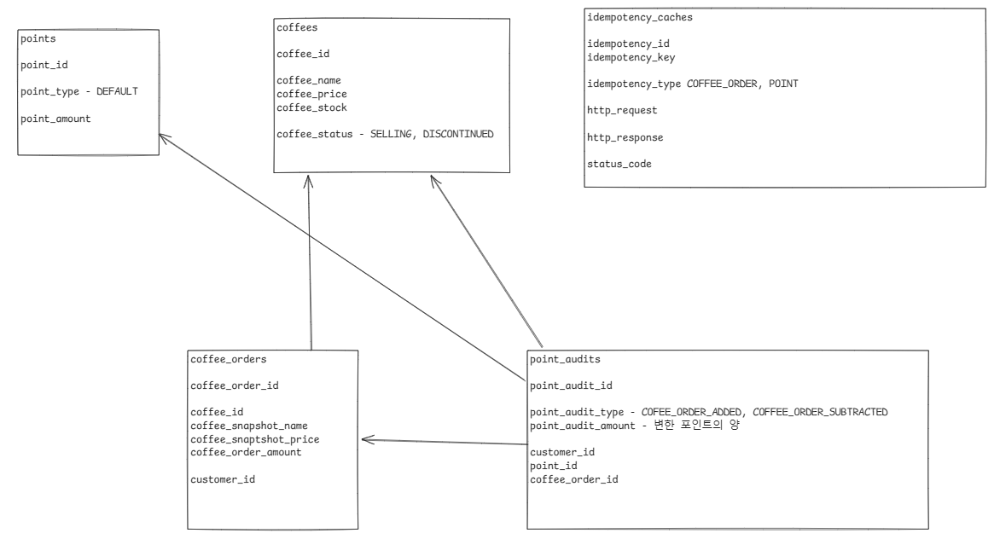

# Toy-Coffee-Shop

간단한 장난감 커피 판매 시스템

# API

- GET /api/coffees/{coffeeId}

- GET /api/coffees

- POST /api/coffee-orders

- GET /api/coffees/popular

- GET /api/points

- POST /api/points

# ERD

# Git Convention

- FEAT:     feature 추가
- FIX:      버그 수정
- REFACTOR: refactoring
- MISC:     기타

